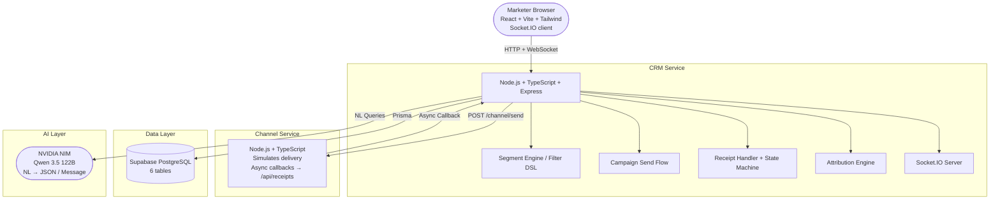

# Xeno Mini CRM — AI-Native Campaign Platform

A Mini CRM for D2C and retail brands to reach shoppers intelligently.
Built as a take-home assignment for Xeno's SDE Internship Drive 2026.

**Live Demo:** [mini-crm-frontend-bice.vercel.app](https://mini-crm-frontend-bice.vercel.app)  
**Repository:** [Kartikeya-guthub/mini-crm](https://github.com/Kartikeya-guthub/mini-crm)

---

## What It Does

Helps a brand marketer answer three critical questions:
- **Who to talk to** — build audiences from customer behaviour using natural language or manual filters
- **What to say** — craft or AI-generate personalised messages per segment
- **How it performed** — track delivery, opens, clicks, and attributed orders in real-time

---

## Architecture



---

## Tech Stack

| Layer | Technology Choice |
|---|---|
| **Backend** | Node.js + TypeScript + Express |
| **ORM** | Prisma |
| **Database** | PostgreSQL (Supabase) |
| **Real-time** | Socket.IO |
| **AI** | NVIDIA NIM — Qwen 3.5 122B |
| **Frontend** | React + Vite + Tailwind |
| **Deployment** | Railway (backend) + Vercel (frontend) |

---

## Key Technical Decisions

### 1. Two-Service Callback Architecture
The CRM and Channel Service are separate deployments communicating over HTTP. When a campaign sends, CRM calls Channel Service → Channel Service simulates delivery asynchronously → fires callbacks back to CRM's `/api/receipts`. This mirrors how real messaging providers (Twilio, SendGrid) work with delivery webhooks.

### 2. Communication State Machine
Each communication follows a strict lifecycle: `queued → sent → delivered/failed → opened → clicked`. Invalid transitions (e.g., `failed → delivered`) are silently dropped with `200 OK` so the channel service does not retry-storm. State is enforced in the receipt handler before any DB write.

### 3. Idempotency via DB Unique Constraint
`UNIQUE(communication_id, event_type)` on `communication_events` with `ON CONFLICT DO NOTHING` semantics. Duplicate callbacks from the channel service are absorbed without corrupting aggregate counts. Chose DB constraint over Redis TTL keys — simpler integration surface, sufficient for this scale.

### 4. Filter DSL as Internal Contract
Both the manual builder and AI parser produce the same `FilterDefinition` JSON:
```json
{
  "combinator": "AND",
  "rules": [
    { "field": "total_spent", "operator": "gte", "value": 5000 },
    { "field": "last_order_at", "operator": "days_ago_gt", "value": 30 }
  ]
}
```
The segment engine converts this to a Prisma `where` clause. AI is an enhancement on top of the manual path, not a dependency. If AI fails, manual filters still work.

### 5. Attribution on Order Creation
When an order is created, the system looks back 48 hours for any `delivered` communication to that customer. If found, `attributed_campaign_id` is set on the order and `attributed_orders` increments on the campaign. Checked at write time rather than lazily at query time so dashboard numbers are always current.

### 6. AI Model Selection
Initially implemented Gemini 2.0 Flash but hit a hard quota wall (`limit: 0`) on the free tier. Benchmarked two NVIDIA NIM models:
- **Mistral Small 4** — consistent 15s+ timeouts (reasoning model, too slow for real-time UI)
- **Qwen 3.5 122B** — 100% schema accuracy, ~10s on free tier, sub-second on paid

Chose Qwen. System prompt combined into user role due to an HTTP 500 bug in this specific Qwen build when using explicit `system` role.

### 7. Socket.IO for Live Campaign Stats
Campaign detail page joins a Socket.IO room (`campaign:{id}`). On every valid receipt callback, the CRM emits updated aggregate counts to that room. Chose Socket.IO over polling for a cleaner demo — the live funnel updating in real time is the primary product moment.

---

## What I Cut and Why

| Feature Cut | At-Scale Production Answer |
|---|---|
| **Redis** | Persistent retry queue + TTL-based idempotency store |
| **Kafka** | Async event pipeline for high-volume callback processing |
| **Auth / Multi-tenant** | JWT + RBAC, brand-scoped data isolation |
| **Docker** | Containerised deployment with orchestration |
| **Real Providers** | Twilio/SendGrid with real webhook lifecycle |
| **A/B Testing** | Message variant testing with statistical significance |
| **Unsubscribe Flows**| Compliance layer (GDPR, DND registry) |

---

## Scale Assumptions

This assignment is scoped for demo scale (~500 customers, single brand). At production scale I would:
- Replace HTTP callbacks with a **Kafka topic** — channel service publishes events, CRM consumes and processes with consumer groups.
- Add **Redis** for idempotency keys with TTL (survive service restarts).
- Use connection pooling (**PgBouncer**) tuned for high write throughput on receipt events.
- Horizontally scale the CRM receipt handler behind a load balancer with **Socket.IO Redis adapter** for pub/sub across instances.
- Cache segment preview counts in Redis with short TTL to avoid repeated full table scans.

---

## Data Model

- `customers` — 500 seeded, Indian locale, denormalised spend/order fields
- `orders` — 2000 seeded, `attributed_campaign_id` for attribution tracking
- `segments` — named filters with cached `customer_count`
- `campaigns` — aggregate counters updated atomically on each receipt
- `communications` — one row per customer per campaign, state machine status
- `communication_events` — event log, `UNIQUE(communication_id, event_type)`

---

## Local Setup

```bash
# Clone and install
git clone https://github.com/Kartikeya-guthub/mini-crm
cd mini-crm
npm install

# Set up environment variables
cp apps/crm/.env.example apps/crm/.env
cp apps/channel/.env.example apps/channel/.env  
cp apps/frontend/.env.example apps/frontend/.env
# Fill in Supabase URLs and NVIDIA API key

# Run migrations and seed
cd apps/crm
npx prisma migrate dev
npx prisma db seed

# Start all backend services
cd ../..
npm run dev

# Start frontend (in a new terminal)
cd apps/frontend
npm run dev
```

---

## Environment Variables

### CRM (`apps/crm/.env`):
```env
DATABASE_URL=
DIRECT_URL=
NVIDIA_API_KEY=
CRM_BASE_URL=
CHANNEL_SERVICE_URL=
FRONTEND_URL=
PORT=3000
```

### Channel (`apps/channel/.env`):
```env
PORT=4000
```

### Frontend (`apps/frontend/.env`):
```env
VITE_API_URL=http://localhost:3000
```
