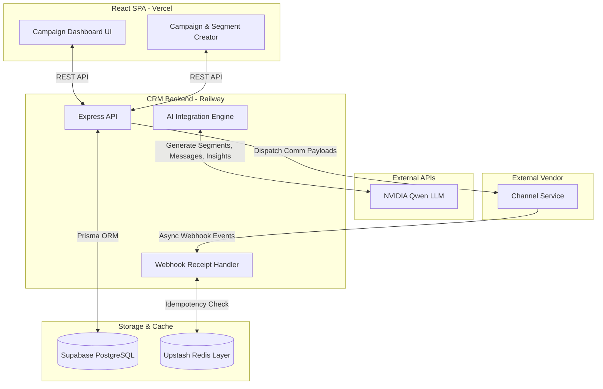

# Xeno CRM — AI-Native Campaign Platform

A two-service, event-driven CRM designed to simplify marketing workflows using artificial intelligence. This platform allows marketers to define audience segments using natural language, auto-generate contextual marketing messages, and analyze post-campaign funnel metrics.

---

## 🏗 System Architecture

The platform utilizes a modern, event-driven architecture to ensure clean separation of concerns.



---

## ✨ Key Features & Engineering Decisions

### 1. AI-Driven Marketing Workflows (NVIDIA Qwen)
We integrated AI into key steps of the marketing funnel to eliminate friction:
- **Natural Language Segmentation:** Marketers type prompts (e.g., *"Users in Mumbai with >₹10,000 spend"*), and the AI converts it into a strictly typed JSON `FilterDefinition` which directly powers PostgreSQL queries.
- **Auto-Generated Messaging:** AI writes contextual, channel-specific messages based on the segment parameters.
- **Post-Campaign Insights:** After a campaign finishes, the AI acts as an analyst, reading the funnel metrics and proactively suggesting a follow-up workflow (e.g., targeting users who opened but didn't convert).

### 2. Event-Driven Architecture
To mirror true production environments, the platform is split into two independent services:
- **CRM Service:** Handles business logic, database queries, and UI interactions.
- **Channel Service:** Simulates an external vendor (like Twilio or SendGrid) that asynchronously processes delivery and engagement events, firing them back to the CRM via webhooks.

### 3. Upstash Redis Webhook Idempotency
To prevent duplicate event processing (e.g., if a vendor retries a webhook due to a network timeout), we implemented an ultra-fast Redis Idempotency Layer.
Before writing to PostgreSQL, the webhook handler executes:
`SET comm_id:event 1 EX 86400 NX`
This guarantees exactly-once processing safely in memory.

### 4. Strict Payload Validation (Zod)
All critical API boundaries are protected by **Zod schemas**. By strictly validating incoming payloads and API endpoints, the system ensures data integrity.

---

## 🚀 Running Locally

### Prerequisites
- Node.js (v20+)
- PostgreSQL Database
- Upstash Redis Instance
- NVIDIA API Key

### Setup Instructions

1. **Install Dependencies**
   ```bash
   npm install
   ```

2. **Environment Variables**
   Create `.env` files in both `apps/crm` and `apps/channel` based on `.env.example`.
   - Ensure `NVIDIA_API_KEY` is set in the CRM service.
   - Ensure `REDIS_URL` is set in the CRM service.

3. **Database Setup**
   ```bash
   cd apps/crm
   npx prisma db push
   npx tsx prisma/seed.ts
   ```

4. **Start the Services**
   ```bash
   # Run from the root directory
   npm run dev
   ```
   *This starts the Frontend (Vite), CRM Backend (Port 3000), and Channel Service (Port 3001) concurrently.*
