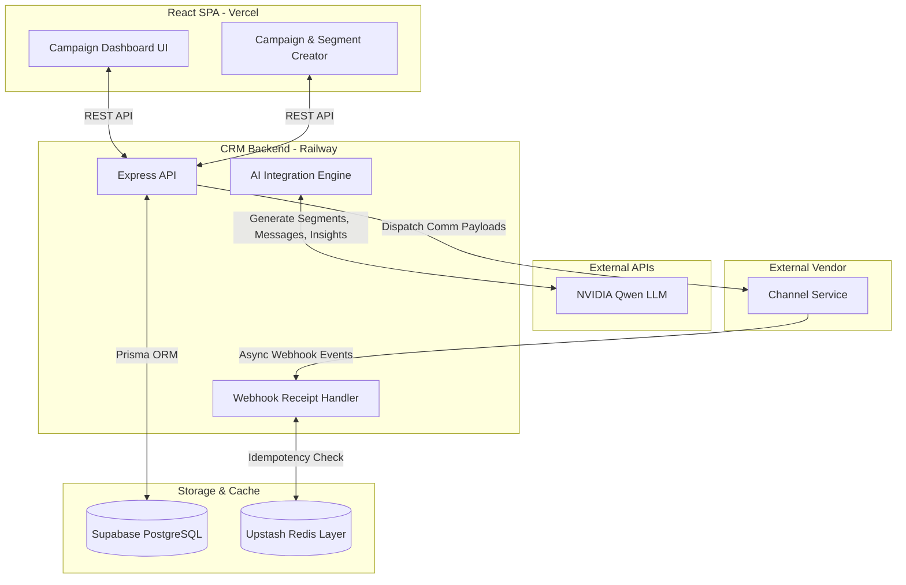

# Xeno Video Demo Script & Guide

*This document contains suggested talking points and pacing for your 5-minute video presentation. Speak naturally and adapt these points to your own voice.*

---

## 1. Product Intro (0.5 min)
**Screen:** Show the Campaign Dashboard.
**Talking Points:**
- "Hi team, I'm Kartikeya. I built a two-service event-driven CRM that simplifies campaign workflows."
- "The core problem I tackled is the friction marketers face when building audiences and analyzing data. I wanted to let them use natural language to segment audiences, write copy, and interpret funnel results, without needing to know SQL or complex query builders."
- "My focus was on building a solid, reliable foundation with a clean separation of concerns between the CRM and the message delivery."

## 2. Functional Demo (1.5 min)
**Screen:** Navigate the app while talking.
**Action:** Go to `Segments` -> `New Campaign`.
**Talking Points:**
- "Let's walk through an end-to-end campaign."
- *Action: Type a natural language prompt like "Customers in Mumbai who have spent over ₹10,000".* 
- "First, I use the NVIDIA Qwen AI model to translate natural language into a strict JSON `FilterDefinition`. This directly queries my PostgreSQL database to build the audience segment instantly."
- *Action: Click "Suggest with AI" for the message.*
- "Next, the AI generates a draft message based on the segment parameters, which the marketer can review."
- *Action: Click "Dispatch Campaign". Navigate to Campaign Detail.*
- "Once we dispatch the campaign, the backend handles the delivery flow."
- *Action: Point out the Recharts Funnel.*
- "You can track the visual engagement funnel here. But the most interesting part happens when the campaign completes..."
- *Action: Click 'Generate Insights'*
- "...I pass the final metrics back to the AI. It acts as an analyst, giving a quick summary of the performance and suggesting a follow-up audience for users who engaged but didn't convert. I can click this button to jump right into that follow-up workflow."

## 3. Technical Architecture (1 min)
**Screen:** Show the Architecture Diagram below (you can open this markdown file in preview mode to show it).

**Talking Points:**
- "To keep the system reliable, I used an event-driven architecture."
- "It's split into two services: a **CRM Service** for the UI and business logic, and a **Channel Service** that acts like an external vendor (like Twilio)."
- "When a campaign fires, the CRM dispatches payloads to the Channel Service, which randomly generates delivery, open, and click events, firing them back to the CRM via webhooks."
- "To handle the incoming webhooks safely, I added an **Upstash Redis Idempotency Layer**. If the Channel Service retries a webhook due to a network delay, Redis catches the duplicate and drops it in memory before it ever hits the Postgres database."

## 4. Code Walkthrough (1 min)
**Screen:** Open VS Code. Show two specific files.
**Talking Points:**
- *Action: Show `apps/crm/src/routes/receipts.ts` or `index.ts` where the Redis logic lives.*
- "Here is the webhook idempotency check. I use a `SET NX` command with an expiration in Redis. It's a simple but effective way to guarantee exactly-once processing."
- *Action: Show `apps/crm/src/routes/campaigns.ts` or `index.ts`.*
- "I also added strict boundary validation. Incoming API payloads and webhook events are validated using Zod schemas. This ensures we don't insert malformed data into the database if the vendor sends something unexpected."

## 5. AI-Native Workflow (1 min)
**Screen:** Back to the camera.
**Talking Points:**
- "For my development workflow, I heavily leveraged AI. I used Claude as my primary dev tool throughout the entire process."
- "I used it for architecture discussions, code generation, and debugging. For example, when adding the Redis idempotency layer, I discussed the approach with the AI, had it help write the Upstash integration, and then I reviewed and understood every line it produced."
- "Working this way allowed me to focus on the core product decisions and build a much more robust two-service architecture in the timeframe."
- "Thanks for your time, and I'd love to answer any questions!"
